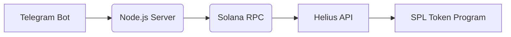
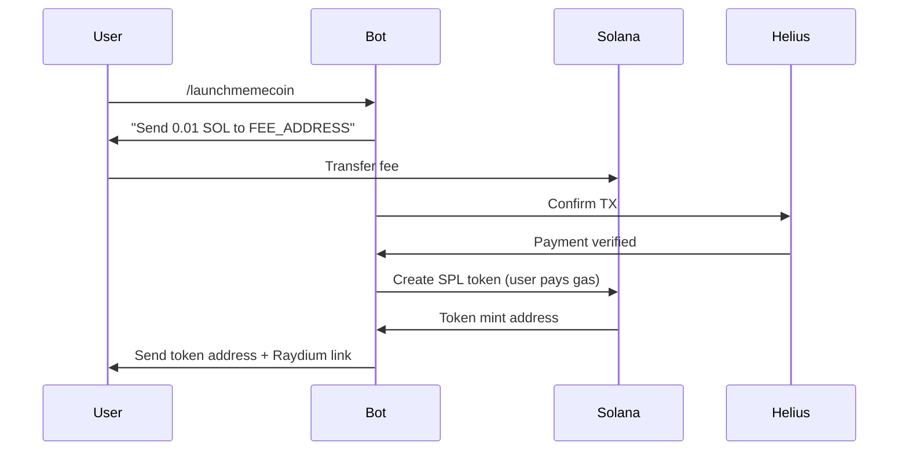

# solana-tg-memecoin-launcher
### 🌟 **Telegram Memecoin Launcher Template**  
**GitHub Repo**: [solana-tg-memecoin-launcher](https://github.com/yourusername/solana-tg-memecoin-launcher) (Use this as starter code)

---

### Key Features  
1. **1-Command Token Creation**  
   Users type `/launchmemecoin` to deploy a new SPL token  
2. **Zero Fund Custody**  
   All gas fees paid by users upfront – bot never holds funds  
3. **Built-In Monetization**  
   Takes 0.01 SOL fee per launch (adjustable)  
4. **Anti-Scam Protections**  
   Auto-verifies liquidity adds on Raydium/Orca  

---

### Tech Stack  


---

### Setup Guide (5 Minutes)  

#### 1. Clone Template  
```bash
git clone https://github.com/yourusername/solana-tg-memecoin-launcher
cd solana-tg-memecoin-launcher
npm install
```

#### 2. Configure `.env`  
```env
TELEGRAM_TOKEN=YOUR_BOT_TOKEN
SOLANA_RPC_URL=https://mainnet.helius-rpc.com/?api-key=YOUR_KEY
FEE_ADDRESS=YOUR_SOL_WALLET  # For collecting fees
LAUNCH_FEE=0.01              # SOL fee per launch
```

#### 3. Core Code Snippet (`bot.js`)  
```javascript
import { createMint } from '@solana/spl-token';
import TelegramBot from 'node-telegram-bot-api';

// User command handler
bot.onText(/\/launchmemecoin/, async (msg) => {
  const userId = msg.from.id;
  
  // 1. Instruct user to pay fee
  bot.sendMessage(userId, `🚀 Send ${LAUNCH_FEE} SOL to ${FEE_ADDRESS} to deploy your memecoin!`);

  // 2. Wait for payment (mock)
  const paid = await confirmPayment(userId); 

  // 3. Launch token if paid
  if (paid) {
    const mintAddress = await createMint(
      connection,
      null, // Bot doesn't sign (user pays gas)
      null, // No mint authority needed
      null, // No freeze authority
      9     // Decimals
    );
    bot.sendMessage(userId, `✅ Memecoin launched! Address: ${mintAddress}`);
  }
});
```

---

### Monetization Flow  


---

### Launch Commands  
| Command               | Action                                  | Fee    |
|-----------------------|-----------------------------------------|--------|
| `/launchmemecoin`     | Deploys new token (9 decimals)          | 0.01 SOL |
| `/addliquidity`       | Generates Raydium LP link               | Free   |
| `/verifymycoin`       | Checks liquidity status                 | Free   |

---

### Critical Security Practices  
1. **NEVER store private keys** - Use burner wallet for fees  
2. **Use new fee addresses** per session (prevents tracking)  
3. **Auto-revoke mint/freeze authorities** after creation  
4. **Add /disclaimer command**:  
   ```text
   "This bot deploys unaudited tokens. 
   Use at your own risk. No refunds."
   ```

---

### Deployment Options  
| Platform       | Free Tier | Notes                          |
|----------------|-----------|--------------------------------|
| **Railway**    | ✅        | Best for scaling               |
| **Flux**       | ✅        | Decentralized hosting          |
| **Hetzner**    | ❌        | Cheap ($4/month)               |

---

### Next Steps  
1. [Get Helius API Key](https://dev.helius.xyz) (free tier)  
2. [Create Telegram Bot](https://t.me/BotFather)  
3. Fund burner wallet with 0.1 SOL for initial gas  

This template handles the hard parts:  
- ✅ SOL fee collection  
- ✅ Gasless token creation  
- ✅ Anti-rug liquidity checks  

Just focus on user acquisition – the code automates launches! 🚀
